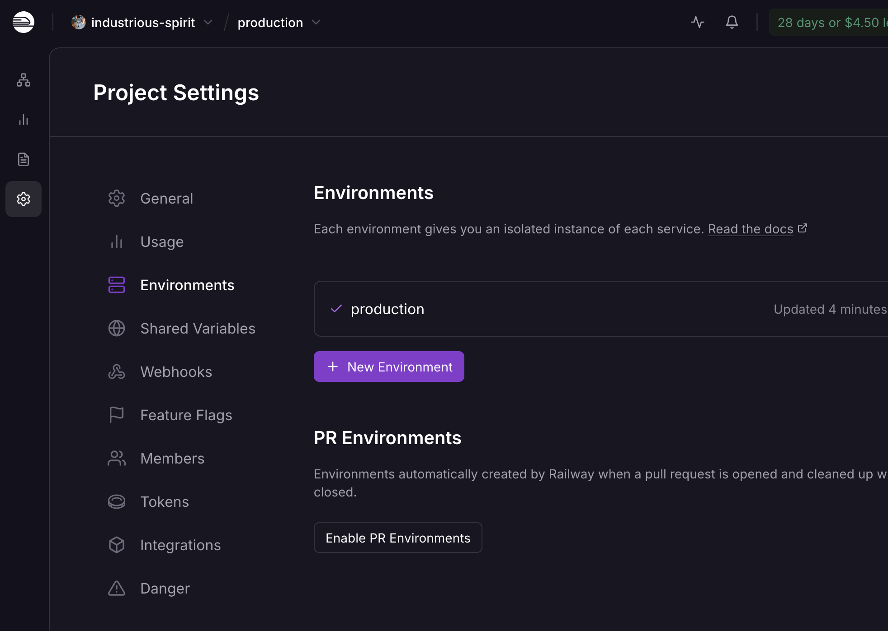

# Railway preview environments

A **PR (preview) environment** is an isolated, full-stack copy of production that
Railway spins up for a pull request: its own `server`, `web-user`, `web-admin`,
and a **fresh Postgres**, each on its own generated domain. It tears down when the
PR merges or closes. This is how you preview a change on a real deployed URL
before it hits production.

See [railway-setup.md](railway-setup.md) for the base per-service config; this
doc assumes that's already done.

## Prerequisite (one-time)

**Project → Settings → Environments → enable PR Environments**, and turn on
**Focused / Isolated** environments so the committed `watchPatterns` (in each
`apps/<name>/railway.json`) decide which services rebuild per PR. Until this is
enabled, opening a PR does nothing on Railway.

Mobile is **not** part of this — it's not a Railway service (it ships via EAS), so
it's never cloned into a preview environment.

## The flow (example: change the user app's header text)

1. Branch, edit the header in `apps/web-user/…`, push, and open a **PR against
   `main`**.
2. Railway creates an **ephemeral environment** cloned from `production`:
   `server`, `web-user`, `web-admin`, and a brand-new Postgres.
3. **Only the services whose `watchPatterns` match the diff rebuild.** A header
   change touches `apps/web-user/**` → only **web-user** rebuilds; `server` and
   `web-admin` come up from their existing images without a rebuild.
4. The server's `preDeployCommand` (`node dist/migrate.mjs`) migrates the fresh
   preview database automatically.
5. Railway gives each service a **preview domain** (e.g.
   `web-user-pr-<n>-….up.railway.app`). Open web-user's to see the change.
6. Push more commits → only matching services rebuild. **Merge or close the PR →
   the whole environment (including its Postgres) is destroyed.**

## What auto-wires (the payoff of reference variables)

Everything resolves _within_ the preview environment — no manual setup, because
the variables use Railway [reference
variables](https://docs.railway.com/guides/variables#reference-variables) rather
than hard-coded URLs:

| Variable                                                                            | Resolves to (in the PR env)     |
| ----------------------------------------------------------------------------------- | ------------------------------- |
| `web-user` / `web-admin` `VITE_API_URL = https://${{server.RAILWAY_PUBLIC_DOMAIN}}` | the **preview** server's domain |
| `server` `CORS_ORIGINS = …${{web-user.RAILWAY_PUBLIC_DOMAIN}}…`                     | the **preview** web domains     |
| `server` `DATABASE_URL = ${{Postgres.DATABASE_URL}}`                                | the **preview** Postgres        |

Because `VITE_*` is baked in at **build time**, and the web app is freshly built
inside the preview env, its bundle points at the preview server — not production.

> **These must be reference variables, not hardcoded URLs.** A literal like
> `VITE_API_URL=https://server-production-….up.railway.app` works in production
> but **silently breaks previews**: every preview web app would call the
> _production_ server + database (no isolation), and the production server's
> `CORS_ORIGINS` wouldn't list the preview web domains, so those calls get
> CORS-blocked. Use the `${{service.RAILWAY_PUBLIC_DOMAIN}}` form — it resolves
> to the same URL in production and to the per-PR URL in a preview. Check the raw
> value with `railway variable list -s web-user --kv` (or the dashboard, where a
> reference renders as a `${{…}}` chip rather than a plain URL).

## Check these on your first preview

Preview environments don't always inherit domain-level settings cleanly, and
these are exactly the traps that cause a green build to still fail (see the
[troubleshooting table](railway-setup.md#troubleshooting)):

- **web-user / web-admin preview domain → Target Port `8080`.** If the
  auto-generated preview domain comes up without it, you get a 502 with
  `x-railway-fallback: true` even though Caddy is healthy. Verify once.
- **The preview web app calls the preview server**, not production — open the
  network tab and confirm requests go to the `…-pr-<n>…` server domain.

## When to use a preview env vs. local dev

Preview environments are heavier than the local inner loop — reach for them
deliberately:

| Use a **preview env** when…                                                            | Use **`pnpm dev`** when…                            |
| -------------------------------------------------------------------------------------- | --------------------------------------------------- |
| You want a **shareable URL** (review, stakeholder sign-off)                            | You're iterating solo                               |
| You need the **real containerized build** (Caddy + baked env, not the Vite dev server) | A quick visual/logic check is enough                |
| The change spans **web + server + DB** and you want them wired together                | The change is contained (e.g. header text, styling) |

A one-line header tweak is a `pnpm dev` job — it hot-reloads instantly with no PR
and no build. Don't spin up a full preview environment for it unless you need one
of the reasons above.
